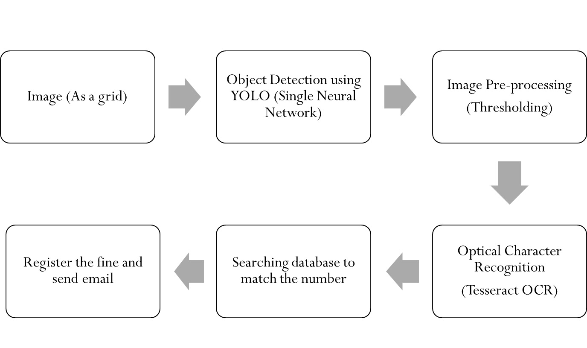
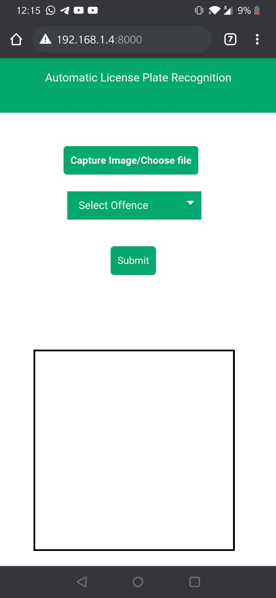
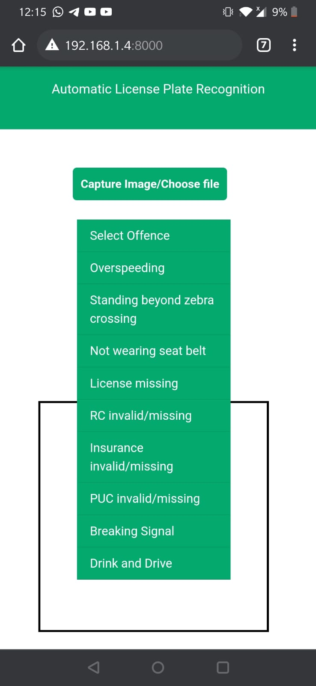
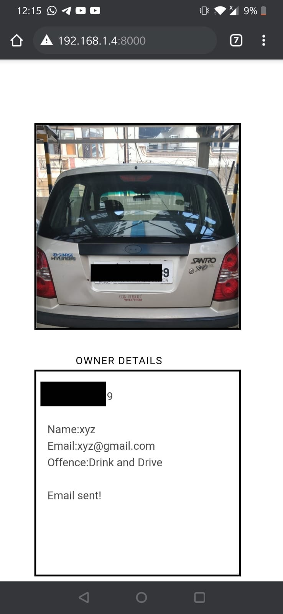
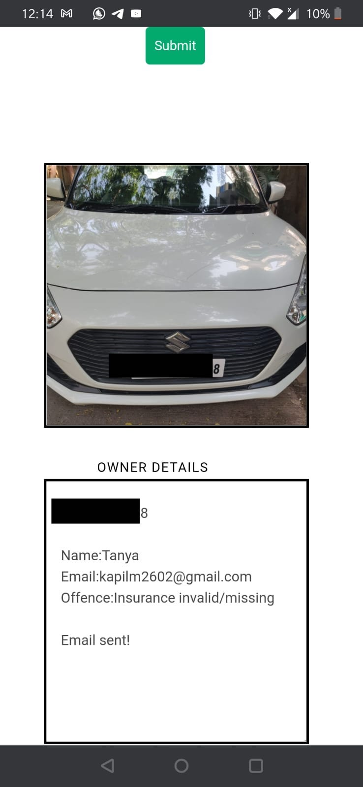
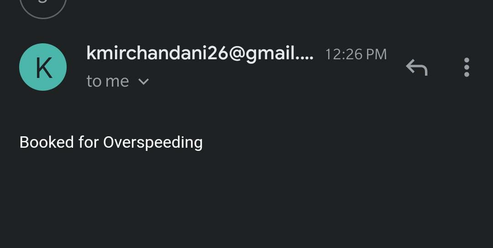

# Automatic License Plate Reader Application
This repo contains an implementation of an application which is used for Automatic License Plate reading and offence booking.
## Overview
Automatic License Plate Recognition (ALPR) is the technique of extracting the information from an image or a sequence of images of Vehicle's Number Plate. Considering the scenario of automation and the developments in artificial intelligence, machine learning and deep learning, everyone is trying to switch towards automation. The current system for issuing fines by the transport department is one such scenario where, making the whole process automatic would help save massive amount of time.
The current model of issuing fines to violators is time consuming and requires a lot of human effort. The photos clicked by the cops are sent to the Regional Transport office for verification and the fines are issued considering the offence registered against the vehicle owner. A feasible way to make this process quicker and more reliable is by reducing the human intervention while carrying out each part of the procedure.
The proposed web application for automatic license plate recognition aims at reducing the human interference by providing a solution for real time license plate detection and recognition. The details of the owner would be visible on the app and the offence for which the vehicle owner is being booked will be a manual choice. The receipt will be sent directly to the owner by email. 
It will reduce the chances of false imposition of fines. As it reduces human intervention, the chances of manipulating the amount to be paid by the owner are also less.         

## Method

## App UI






For more details, refer to our project report: https://drive.google.com/file/d/1T2CuI0HmKRiUyxGygH9FH6TN2xa3mQjO/view?usp=sharing
## Usage
### Installation
```bash
git clone https://github.com/KapilM26/license-plate-reader.git
cd license-plate-reader
pip3 install -r requirements.txt
```
It is recommended to create a virtual environment for this project.
### Preliminary application setup
#### Email.config
The application uses a file called `email.config` to get the Email ID and password of the account to send the email to the offender.
Create the file `email.config` inside the `alpr/` folder.
The first line of this file should have the email ID and the second line should have the password.
Make sure not to push this file to Github!

#### Download/train model
The pretrained YOLOv3 model can be downloaded from here: https://drive.google.com/file/d/14sR8yAX-ByUxUGARqr3YU5vmnuaNeSbZ/view?usp=sharing
Download this file and put it inside `alpr/models`.
Alternatively, you can refer to the `train_yolo_alpr` notebook to train a custom model.

YOLO implementation used: https://github.com/eriklindernoren/PyTorch-YOLOv3

Dataset used for training: https://web.inf.ufpr.br/vri/databases/ufpr-alpr/

### Running the application
```bash
cd alpr
python3 manage.py runserver
```
This will run a local server on http://127.0.0.1:8000/
You can also run a server on a particular IP address by specifying it (along with the port) in the runserver command.
```bash
python3 manage.py runserver <IP>:<PORT>
```